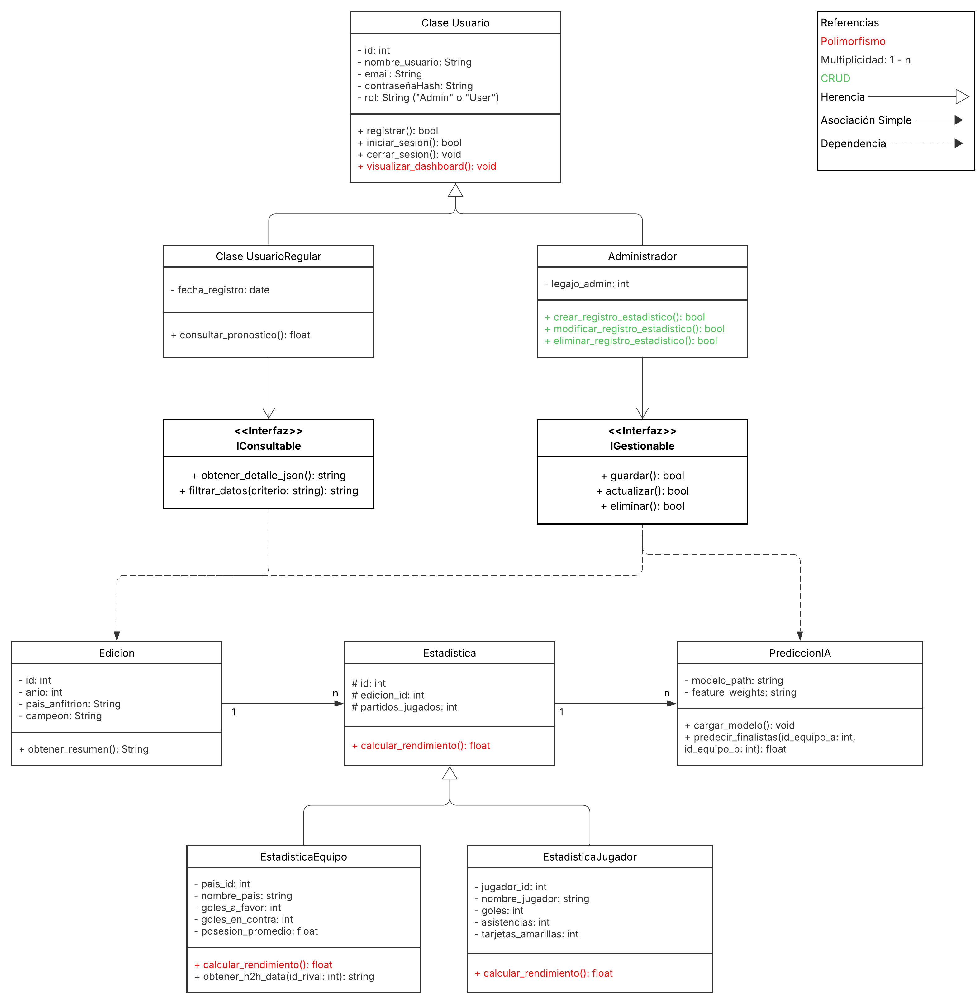
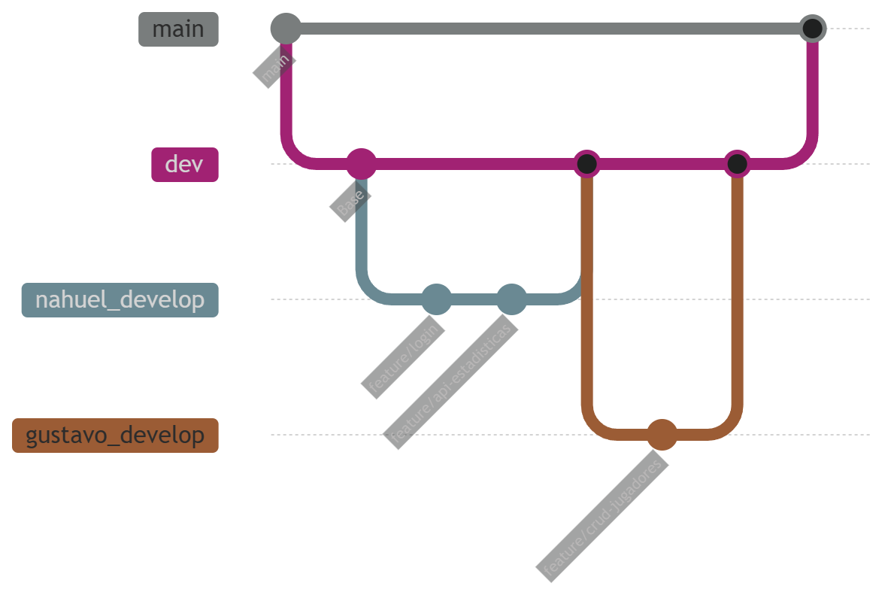

# Mundial Web App — Estadisticas del Mundial de Futbol

Plataforma web interactiva para la gestion, visualizacion y prediccion de estadisticas historicas del Mundial de Futbol (1930-2022) con sincronizacion en vivo para la edicion 2026. Desarrollada bajo arquitectura MVC con separacion clara de responsabilidades entre Frontend, Backend y capa de inteligencia artificial.

---

## Indice

- [Arquitectura del Sistema](#arquitectura-del-sistema)
- [Tecnologias Utilizadas](#tecnologias-utilizadas)
- [Estructura del Proyecto](#estructura-del-proyecto)
- [Guia de Instalacion](#guia-de-instalacion)
- [Ingesta de Datos (ETL)](#ingesta-de-datos-etl)
- [Ejecucion del Oraculo IA](#ejecucion-del-oraculo-ia)
- [Endpoints de la API](#endpoints-de-la-api)
- [Diagrama UML](#diagrama-uml)
- [Estrategia de Ramas (Git)](#estrategia-de-ramas-git)
- [Integrantes](#integrantes)
- [Referencias y Creditos](#referencias-y-creditos)

---

## Arquitectura del Sistema

La aplicacion se compone de tres capas principales:

```
┌─────────────────────────────────────────────────────────┐
│                    FRONTEND (React)                      │
│   Vistas: Landing, Login, Register, Dashboard Admin,    │
│           Head-to-Head, Rankings, Oraculo IA            │
│   State: AuthContext + React Query                       │
└──────────────────────────┬──────────────────────────────┘
                           │ HTTP / JSON
┌──────────────────────────▼──────────────────────────────┐
│                    BACKEND (Flask)                        │
│   Blueprints: auth, estadisticas, admin, h2h,           │
│               rankings, oracle                           │
│   Servicios: CSVImporter, APISyncService,                │
│              MonteCarloPredictor, MLPredictor            │
└──────────────────────────┬──────────────────────────────┘
                           │ SQL / PyMySQL
┌──────────────────────────▼──────────────────────────────┐
│                   BASE DE DATOS (MySQL)                   │
│   Tablas: usuarios, ediciones, estadisticas_equipos,    │
│           estadisticas_jugadores, partidos               │
│   Datos:  ~77.000 registros historicos (1930-2022)      │
└─────────────────────────────────────────────────────────┘
```

**Frontend:** Aplicacion SPA construida en React 19 con enrutamiento client-side, estado global via Context API y obtencion de datos con React Query. El dashboard admin permite gestionar entidades CRUD y ejecutar operaciones de ingesta de datos.

**Backend:** API REST construida en Flask con arquitectura de blueprints. Autenticacion JWT con roles (Admin/User). Capa de servicios para ETL (pandas), sincronizacion con API-Football y modelos predictivos.

**Oraculo IA:** Motor de predicciones que combina simulaciones Monte Carlo (distribucion de Poisson) con un modelo de Machine Learning (RandomForestClassifier de scikit-learn) entrenado sobre datos historicos.

---

## Tecnologias Utilizadas

### Frontend

| Tecnologia | Uso |
|---|---|
| React 19 | Framework UI con hooks funcionales |
| TypeScript | Tipado estatico |
| Tailwind CSS v4 | Sistema de estilos utilitario |
| React Router v7 | Enrutamiento client-side |
| Axios | Cliente HTTP para consumo de API |
| React Query | Cache y gestion de estado del servidor |
| Recharts | Visualizacion de datos (graficos de barras, radar) |
| Framer Motion | Animaciones y transiciones de interfaz |
| Lucide React | Biblioteca de iconografia |
| Vite | Bundler y servidor de desarrollo |

### Backend

| Tecnologia | Uso |
|---|---|
| Python 3.12 | Lenguaje del backend |
| Flask | Framework web ligero |
| PyMySQL | Driver de conexion MySQL |
| PyJWT | Generacion y validacion de tokens JWT |
| bcrypt | Hashing seguro de contrasenias |
| pandas | Manipulacion y transformacion de CSVs |
| numpy | Operaciones numericas (simulaciones) |
| scipy | Distribuciones estadisticas (Poisson) |
| scikit-learn | Modelos de Machine Learning supervisado |
| joblib | Serializacion de modelos entrenados |
| requests | Clientes HTTP para API-Football |

### Base de Datos

| Componente | Detalle |
|---|---|
| MySQL 8.x | Motor de almacenamiento relacional |
| InnoDB | Engine con soporte de transacciones y FK |
| utf8mb4 | Codificacion de caracteres (soporte completo) |

---

## Estructura del Proyecto

```
Parcial_Programacion_3/
├── .env                          # Variables de entorno (no se sube al repo)
├── .env.example                  # Plantilla de variables de entorno
├── backend/
│   ├── app.py                    # Entry point de Flask
│   ├── schema.sql                # DDL de la base de datos
│   ├── seed.py                   # Script de datos iniciales
│   ├── ml_train.py               # Script de entrenamiento del modelo ML
│   ├── requirements.txt          # Dependencias de Python
│   ├── models/                   # Modelos ML serializados (.joblib)
│   ├── data/raw_fjelstul/        # 27 archivos CSV del dataset historico
│   └── app/
│       ├── database.py           # Conexion MySQL (PyMySQL)
│       ├── models/               # Active Record (User, Edition, TeamStatistic, PlayerStatistic, Match)
│       ├── controllers/          # Logica de negocio (auth, estadisticas, admin, h2h, rankings, oracle)
│       ├── routes/               # Blueprints Flask (auth, estadisticas, admin, h2h, rankings, oracle)
│       ├── services/             # Servicios (CSVImporter, APISyncService, MonteCarloPredictor, MLPredictor)
│       ├── middlewares/          # Decoradores JWT (token_required, admin_required)
│       └── utils/                # Utilidades (csv_paths, api_config)
├── frontend/
│   ├── package.json              # Dependencias de Node.js
│   ├── vite.config.ts            # Configuracion de Vite
│   ├── tailwind.config.js        # Configuracion de Tailwind CSS
│   └── src/
│       ├── App.tsx               # Router principal
│       ├── main.tsx              # Entry point de React
│       ├── index.css             # Estilos globales + Tailwind
│       ├── context/              # AuthContext (estado de sesion)
│       ├── hooks/                # Custom hooks (useAuth, useHeadToHead, useRankings, useOracle)
│       ├── pages/                # Paginas (Home, Login, Register, Dashboard, HeadToHead, Rankings, Oracle)
│       └── components/           # Componentes reutilizables (Navbar, ProtectedRoute, DataManagementPanel, ui/, h2h/, rankings/, oracle/)
└── ayudas_y_recursos/            # Material de apoyo y documentacion
```

---

## Guia de Instalacion

### Prerequisitos

- Node.js >= 18 y npm
- Python 3.12+
- MySQL 8.x corriendo en `localhost:3306`
- Git

### 1. Clonar el repositorio

```bash
git clone https://github.com/Nahuelito22/Parcial_Programacion_3.git
cd Parcial_Programacion_3
```

### 2. Configurar variables de entorno

Copiar la plantilla y completar con los valores reales:

```bash
cp .env.example .env
```

El archivo `.env` debe contener:

```env
# MySQL
MYSQL_HOST=127.0.0.1
MYSQL_PORT=3306
MYSQL_USER=root
MYSQL_PASSWORD=tu_password
MYSQL_DATABASE=mundial_db

# JWT
JWT_SECRET_KEY=tu_clave_secreta_aqui
JWT_ACCESS_TOKEN_EXPIRES=3600

# API-Football (opcional, para sincronizacion 2026)
API_FOOTBALL_BASE_URL=https://v3.football.api-sports.io
API_FOOTBALL_KEY=tu_api_key_aqui
API_FOOTBALL_LEAGUE_ID=1
API_FOOTBALL_SEASON=2026
```

### 3. Configurar la base de datos

```bash
# Crear la base de datos y las tablas
mysql -u root -p < backend/schema.sql

# (Opcional) Cargar datos de prueba
cd backend
python seed.py
```

### 4. Instalar dependencias del Backend

```bash
cd backend
python -m venv venv

# Windows
venv\Scripts\activate

# Linux/Mac
source venv/bin/activate

pip install -r requirements.txt
```

### 5. Instalar dependencias del Frontend

```bash
cd frontend
npm install
```

### 6. Iniciar los servidores

En una terminal (Backend):

```bash
cd backend
python app.py
# Flask corre en http://127.0.0.1:5000
```

En otra terminal (Frontend):

```bash
cd frontend
npm run dev
# Vite corre en http://localhost:5173
```

---

## Ingesta de Datos (ETL)

La aplicacion incluye un sistema de ingesta de datos que carga el dataset historico de 27 archivos CSV (aproximadamente 77.000 registros) en la base de datos MySQL.

### Carga del historico CSV

Desde la interfaz de administrador (Panel de Control > Ingesta de Datos), hacer click en **"Importar Historico CSV"**. Esta operacion:

1. Lee 9 archivos CSV del directorio `backend/data/raw_fjelstul/`
2. Transforma y agrega los datos usando pandas
3. Inserta registros en las tablas: `ediciones`, `estadisticas_equipos`, `estadisticas_jugadores` y `partidos`
4. Maneja duplicados mediante estrategia de borrado e reinsercion (idempotente)

Alternativamente, se puede ejecutar el endpoint directamente:

```bash
curl -X POST http://127.0.0.1:5000/api/admin/import-csv \
  -H "Authorization: Bearer <token_admin>"
```

### Sincronizacion con API-Football

Para obtener datos en vivo del Mundial 2026, usar la opcion **"Sincronizar Mundial 2026"** en el Panel de Control. Esta operacion:

1. Consulta la API de API-Football para obtener equipos, partidos y estadisticas
2. Inserta o actualiza registros en las tablas existentes
3. Maneja limites de tasa (rate limiting) y reconexiones automaticas

Requiere una API key valida configurada en la variable `API_FOOTBALL_KEY` del archivo `.env`.

### Vaciar la base de datos

La opcion **"Vaciar Todo"** elimina todos los registros de las tablas `estadisticas_jugadores`, `estadisticas_equipos` y `ediciones` en orden seguro de claves foraneas. Esta operacion requiere confirmacion del usuario.

---

## Ejecucion del Oraculo IA

El Oraculo IA ofrece predicciones de resultados de partidos utilizando dos metodos:

### Metodo Monte Carlo (disponible por defecto)

Simula 10.000 partidos virtuales utilizando distribuciones de Poisson parametrizadas con las estadisticas historicas de ambos equipos. No requiere entrenamiento previo.

### Metodo Machine Learning (requiere entrenamiento)

Utiliza un RandomForestClassifier entrenado sobre datos historicos para predecir probabilidades de victoria, empate o derrota.

**Entrenar el modelo antes de usar:**

```bash
cd backend
python ml_train.py
```

El script:
1. Extrae features de las estadisticas de equipos y partidos historicos
2. Entrena un RandomForestClassifier (80% train, 20% test)
3. Evalua el modelo (accuracy, F1-score)
4. Serializa el modelo en `backend/models/match_predictor.joblib`

Una vez entrenado, el endpoint `/api/oracle/predict` utilizara automaticamente el modelo ML. Si el modelo no existe, el sistema recurre al metodo Monte Carlo.

---

## Endpoints de la API

### Autenticacion

| Metodo | Endpoint | Auth | Descripcion |
|---|---|---|---|
| POST | `/api/auth/register` | Publico | Registro de usuario |
| POST | `/api/auth/login` | Publico | Inicio de sesion, retorna JWT |
| GET | `/api/auth/me` | Token requerido | Perfil del usuario actual |

### Estadisticas

| Metodo | Endpoint | Auth | Descripcion |
|---|---|---|---|
| GET | `/api/ediciones` | Publico | Listar ediciones mundiales |
| POST | `/api/ediciones` | Admin | Crear edicion |
| PUT | `/api/ediciones/:id` | Admin | Actualizar edicion |
| DELETE | `/api/ediciones/:id` | Admin | Eliminar edicion |
| GET | `/api/estadisticas/equipos` | Publico | Estadisticas de equipos |
| GET | `/api/estadisticas/equipos/edicion/:id` | Publico | Equipos por edicion |
| GET | `/api/estadisticas/jugadores` | Publico | Estadisticas de jugadores |
| GET | `/api/estadisticas/jugadores/edicion/:id` | Publico | Jugadores por edicion |

### Administracion

| Metodo | Endpoint | Auth | Descripcion |
|---|---|---|---|
| POST | `/api/admin/import-csv` | Admin | Importar historico CSV |
| POST | `/api/admin/sync-api` | Admin | Sincronizar Mundial 2026 |
| POST | `/api/admin/clear-db` | Admin | Vaciar base de datos |

### Analisis (Dashboard de Usuario)

| Metodo | Endpoint | Auth | Descripcion |
|---|---|---|---|
| GET | `/api/h2h/equipos` | Publico | Selecciones disponibles para H2H |
| GET | `/api/h2h/equipos/:a/:b` | Publico | Historial Head-to-Head entre dos equipos |
| GET | `/api/h2h/jugadores` | Publico | Jugadores disponibles para H2H |
| GET | `/api/h2h/jugadores/:a/:b` | Publico | Historial Head-to-Head entre dos jugadores |
| GET | `/api/rankings/top-goleadores` | Publico | Ranking de goleadores |
| GET | `/api/rankings/top-asistentes` | Publico | Ranking de asistentes |
| GET | `/api/rankings/selecciones-mas-participaciones` | Publico | Selecciones con mas participaciones |
| GET | `/api/rankings/selecciones-mas-goles` | Publico | Selecciones con mas goles historicos |
| GET | `/api/rankings/mayor-posesion` | Publico | Selecciones con mayor posesion promedio |
| POST | `/api/oracle/predict` | Publico | Predecir resultado de un partido |
| GET | `/api/oracle/methods` | Publico | Metodos de prediccion disponibles |

---

## Diagrama UML

<picture>
  <source media="(prefers-color-scheme: dark)" srcset="Imagenes_Readme/Diagrama_UML_Fondo_Blanco.png">
  <source media="(prefers-color-scheme: light)" srcset="Imagenes_Readme/Diagrama_UML.png">
  
</picture>

*El diagrama refleja la aplicacion de conceptos de Encapsulamiento, Herencia y Polimorfismo en el Backend. La clase abstracta `Statistic` define el contrato comun para `TeamStatistic` y `PlayerStatistic`, cada una implementando su propia logica de `calculate_performance()`.*

---

## Estrategia de Ramas (Git / GitHub)

- **`main`**: Rama principal y protegida. Solo contiene codigo funcional y estable.
- **`dev`**: Rama de desarrollo e integracion. Fusion de cambios aprobados antes de pasar a `main`.
- **`Nahuel_Develop` / `Gustavo_Develop`**: Ramas personales de cada desarrollador para cambios estructurales de los modulos asignados.
- **`feature/*`**: Ramas efimeras creadas desde la rama del desarrollador para caracteristicas especificas (ej: `feature/head-to-head`, `feature/rankings`, `feature/oracle-ai`).

### Flujo de Trabajo



---

## Integrantes

| Nombre | Modulo | Rol |
|---|---|---|
| **Nahuel Ghilardi** | Estadisticas, Dashboard, API Sync, Oraculo IA | Backend & Frontend Developer |
| **Gustavo Garcia** | Estadisticas, Autenticacion, CRUD | Backend Developer |

---

## Referencias y Creditos

### Datos Historicos

El dataset historico utilizado en esta aplicacion proviene del **Fjelstul FIFA World Cup Dataset**, una coleccion curada de datos de todas las ediciones de la Copa Mundial de la FIFA (1930-2022).

- Sitio web: [https://www.worldcups.ai/](https://www.worldcups.ai/)
- Autor: **Josh Fjelstul, Ph.D.**
- Licencia: Uso academico con atribucion

### Datos en Vivo

Los datos en tiempo real del Mundial 2026 son provistos por:

- **API-Football**: [https://www.api-football.com/](https://www.api-football.com/)
- Endpoint: `v3.football.api-sports.io`
- Uso: Sincronizacion de partidos, equipos y estadisticas en vivo

### Documentacion del Codigo

El codigo fuente esta documentado de forma interactiva en DeepWiki:

- **DeepWiki**: [https://deepwiki.com/Nahuelito22/Parcial_Programacion_3](https://deepwiki.com/Nahuelito22/Parcial_Programacion_3)

[](https://deepwiki.com/Nahuelito22/Parcial_Programacion_3)

---

## Roadmap

| Fase | Descripcion | Estado |
|---|---|---|
| 1 | Diseno de BD y Diagrama UML de Clases | Completada |
| 2 | Configuracion de repositorios y entornos (Flask + React) | Completada |
| 3 | Backend Core: Autenticacion JWT y CRUD de Estadisticas | Completada |
| 4 | Frontend Core: Rutas, Contexto de Auth y Formularios | Completada |
| 5 | Dashboard, Graficos y Consumo de API REST | Completada |
| 6 | Ingesta de Datos: ETL CSV y Sincronizacion API-Football | Completada |
| 7 | Analisis: Head-to-Head, Rankings y Oraculo IA | Completada |
| 8 | Despliegue en produccion | Pendiente |
